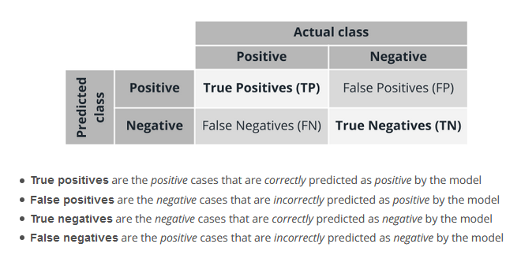
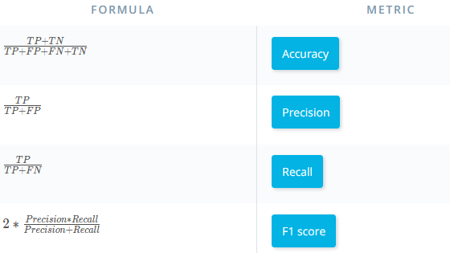

# Day 11

Today has been a tight day for me and I can't let this go so I didn't do much.
* I went through the **concept of the confusion matrix**. 
Using the cat and dog image classification example was a great way to communicate the idea of False Positives and True Negatives.

* The different **evaluations metrics for classification**; 

  1. Accuracy, 
  2. Precision, 
  3. Recall, 
  4. F1_score. 
  
None of these can independently serve as a good indicator for the model performance.

* The ROC(Receiver operation characteristics) and the AUC(Area Under Curve).
ROC is one of the most important charts used to evaluate classification models. It is a graph of the rate of TPs against the rate of FPs. From this, the **AUC** is derived,
it is the area of the surface that lies under the ROC curve. This AUC value lies between 0 and 1. The closer the value to 1, the better the clasification model
The **Gain and Lift charts** are some other charts used for classification evaluation.
* An AUC of 0.5 indicates random guessing, while an AUC of 1.0 indicates perfect classification.

I encourage everyone to keep on:muscle:
