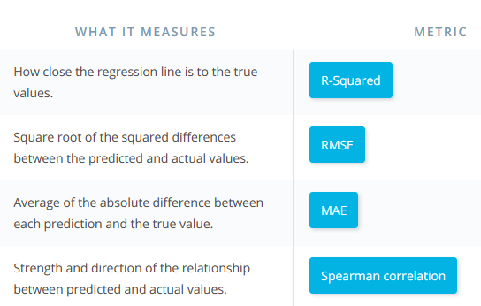
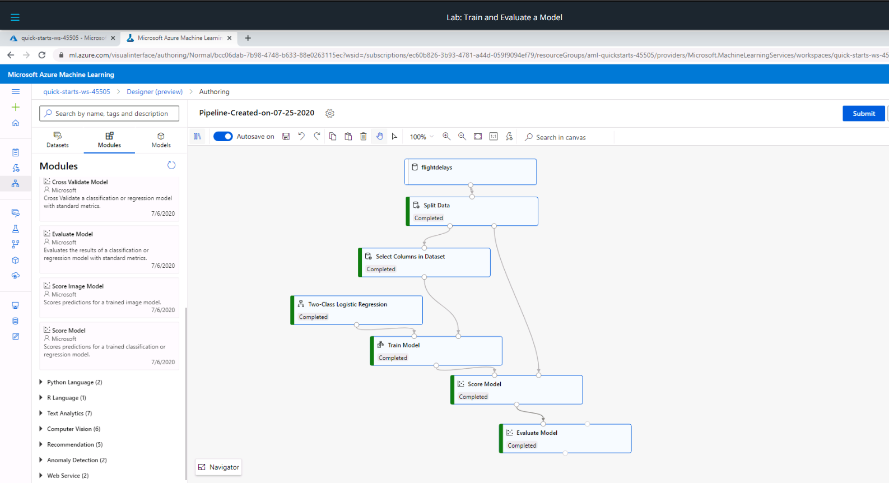
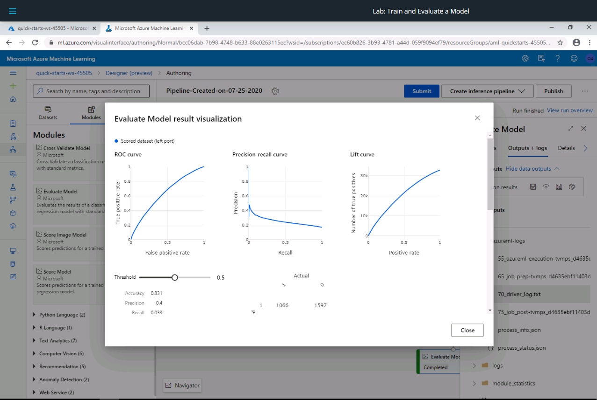
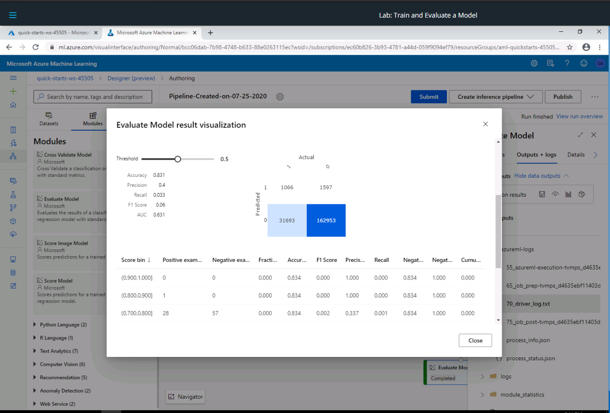
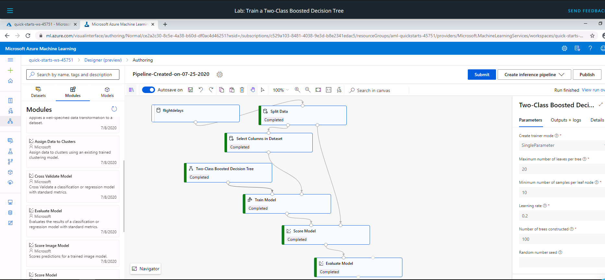
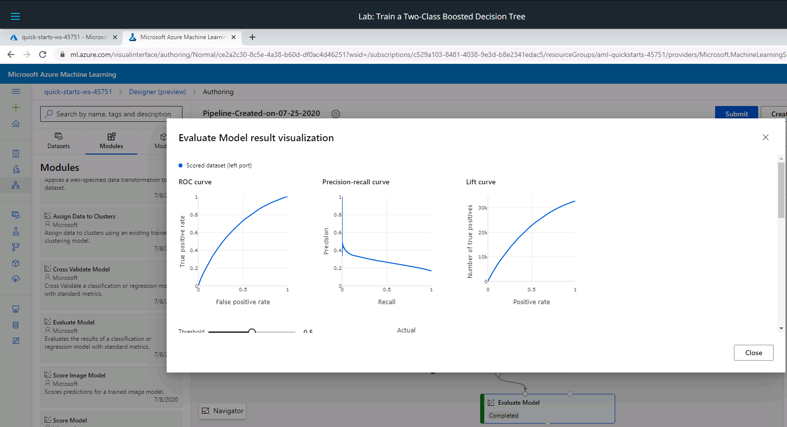
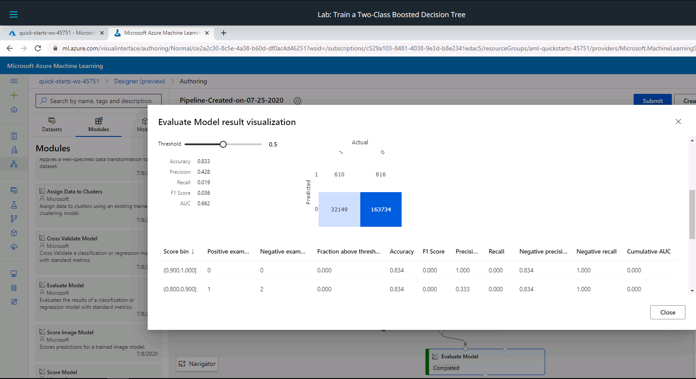

# Day 12

## Evaluation Metrics for Regression.
* RMSE
* MAE
* R_squared sometimes referred to as coefficient of determination and it measures how close the predicted value is to the regression line.
* Spearman Correlation measures the correlation between the predicted values and the actual values.

For more info about the different performance metric, this [link](https://docs.microsoft.com/en-us/azure/machine-learning/algorithm-module-reference/evaluate-model#bkmk_classification) can be helpful.

Just like classification, there are several charts that are used to visually analyze the performance of regression models. Some of these charts include
* Predicted vs True Chart
* Histogram of residuals which displays the distribution of true minus predicted values.

### Lab: Train and Evaluate a Model
In this lab, a classification model is trained to predict if a flight will be 15 minutes delayed or more.

From the above work, the following results were obtained

## Ensemble and Automated Machine Learning.
### Ensemble Learning.
Withe this, several models are trained and combined to produce a final predictive model. The same data is used to train the different models. There are several ensemble learning algorithms and 
some of them include
* Bagging
* Boosting
* Stacking
All these are based on the concept that having a large number of ML models and combining their output to produce a final model is statistically a better appraoch to having higher quality predictions.
### Lab: Train a Two-Class Boosted Decision Tree
This lab aimed at looking at ensemble learning and the **Two-Class Boosted Decision Tree** algorithm is used to build a classification model to predict if flights will be delayed for more than 15 minutes or not.

The following results were obtained

## Automated Machine Learning.
* Models are automatically chosen and different hyperparameter values and features are trained. 
* The best performing combination is returned as the predictive model.
* A stopping criterion is specified and this governs when the interative process of using different hyperrameter values for differnt models can stop.
* This is best regarded as a way to get the baseline model for good predictions.
* The final model is ready for deployment.

### Lab: Train a Simple Classifier with Automated ML
Compared to other model training labs that have happened so far in this course, the automated ML lab was different and its interface was different.
