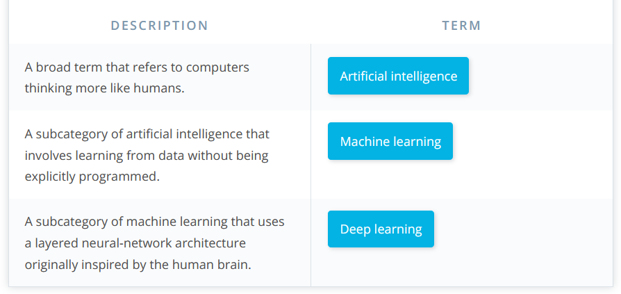

# Day 2

* Brief history of machine learning
* The Data science process
* Difference between Artificial intelligence, machine learning and deep learning [article](https://blogs.nvidia.com/blog/2016/07/29/whats-difference-artificial-intelligence-machine-learning-deep-learning-ai/)

## The Data science process

### Collect Data: Writing code to
* query databases
* retrieve files
* scraping websites
* calling webservices

### Prepare Data: Writing code to
* clean the data
* impute missing values
* compute aggregate metrics
* explore and visualize the data
* identify useful features fo modelling

### Train model: Writing code to
* set up model training pipeline
* feature vectorization
* feature scaling
* tuning the machine learnign algorithm
* looking at the model performance
* maths to evalute the model 
* visualize interpreting graphs

### Evaluate the model
* write code or do maths to test and compare performance of different models
* compute evaluation metrics or graphs on test data

### Deploy model
* do devops
* integrate the training, evaluation and deployment.
