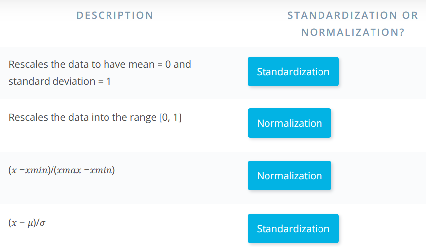

# Day 5:
Today, I covered a  few concepts in lesson 2
* Scaling data
* Encoding categorical data
* Image data
* Text data
* Two perspectives of ML

#50daysofudacity reminds me of some task I have to accomplish every day just before midnight. I am glad I pledged for this challenge. :fire: Slowly but surely:blush:

## Scaling Data

This refers to the process of transforming data values to fit into a particalur range. One very renown importance of this is the possibility of a faster trainign process after scaling the data. There are several appraches use to achieve this.

#### Approaches
1. Standardization
2. Normalization
 
### Standardization: 
This basically aims at scaling the data to have a mean of 0 and a variance of 1. The equattion used is
_add equation_

### Normalization:
The process of normalization rescales the data into the range 0,1 using the following equation.
_add equation_

## Ecoding Categorical Data.

A mentioned earlier, any data usually has to end up in numberical form to be used for modelling. Encoding categorical data converts the categories into numeric form. There are several approaches to this. Some of which are
* ordinal encoding
* One hot encoding

### Ordinal Encoding:
Here, numbers are assigned to the differnt categories ranging from 0 to the number of categories minus 1.
**Drawback:** implicit assumption of order in the categories hence some categories appear to be more relevent that the others.

### One hot enconding:
One hot encoding addresses the challenge with ordinal encoding. Here, each category tranforms to a column. This new column contains 0s and 1s. If there are n categories, n new columns are generated.
**DrwaBack:** increase  in the dimentionality if the datatset.

## Image Data
In ML, we always work with numbers. An image is made up of several pxiels, each pixel has a set of values.
