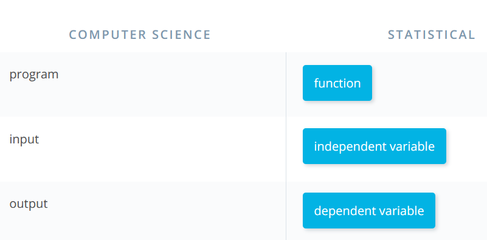
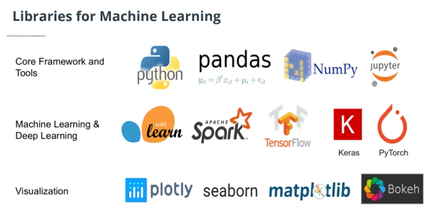
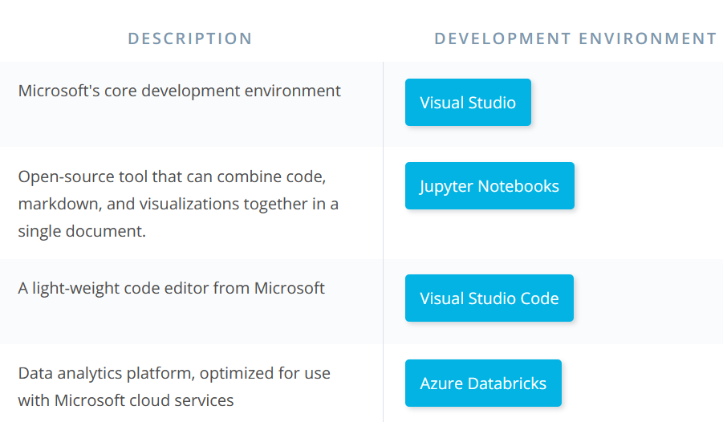
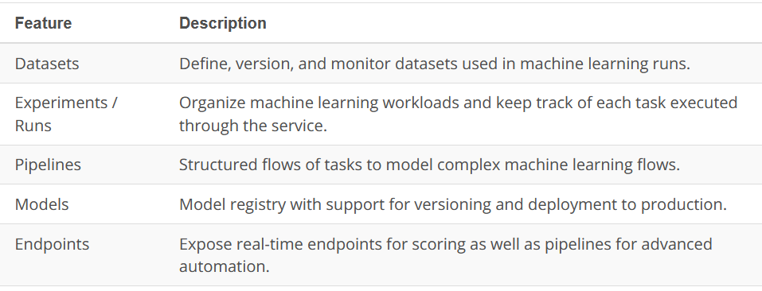
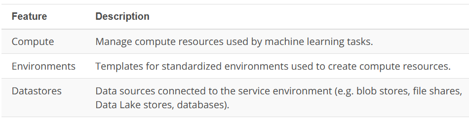
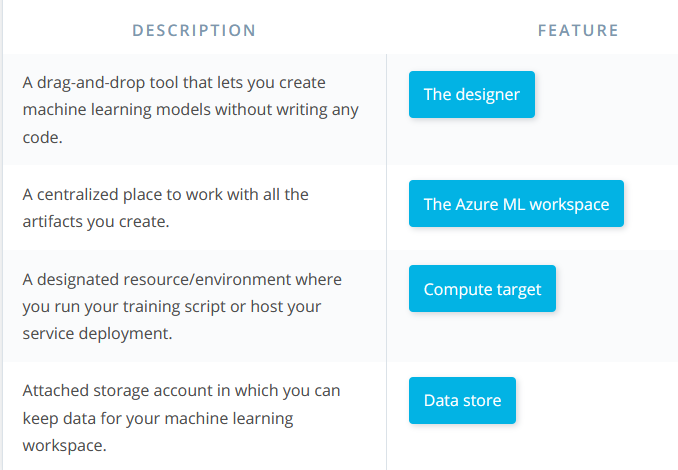
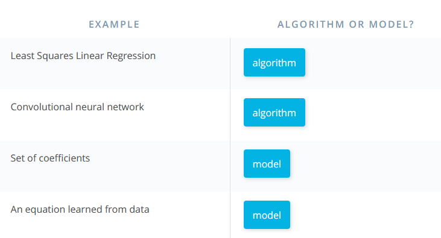
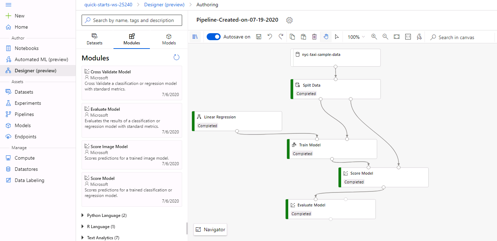

# Day 6

**Yaaay!** :dancer::fire:

Completed my first lab session on Azure today. Say what????? Drag and drop for Machine Learning? Awesome!!!

So today, I
* Went deep into the Computer Science and Statistical perspectives of ML.

* Studied the Tools of Machine Learning. The three main typical components to employ in an ML ecosystem being
  * Libraries
  
  
  [Libraries_uses](lib_uses.PNG)
  
  * Development environments
  
  
  
  * Cloud services
    * **Core Assets**
    
    
    
    * **Resources**
    
    
    
* Brief intro to Azure ML

    
* Learned the difference between Models and Algorithms
   * **Models:** Specific representations learned from data, representing what is learned by the ML algorithm.
   * **Algorithms:** Process of learning, a mathematical tool that can be represented by an equation.
   
   
* Studied the Linear regression algorithm.
  * Simple Linear Regression: One independent variable
  * Multiple Linear Regression: More than one independent variable.
  * Linear regression assumptions to consider when preparing data for Linear Regression.
* Finally, completed the **Train a Linear Regression Model** lab.

**#50daysofudacity** :fire::fire::fire:
