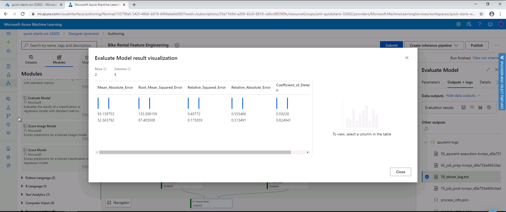

# Day 9

* Learned about features and feature engineering as an important part of data preparation.

Feature engineering is regarded as the most important part of data preparation though it is not always necessary.
Given a dataset, the task of feature engineering aims at generating new features. This process increases the 
chances of success in a machine task, increases the power of algorithms by generating features that are more
suitable for the algorithms.

* The process of selecting the most relevant features-> Feature Selection and its importance.

Since machine learning algorithms connot accomodate a huge number of features, feature selection comes into play.
The issues that come with the many number of features are referred to as the curse of dimensionality. Feature selection 
is sometimes referred to as dimensionality reduction.

**Though feature engineering is the most important task in data preparation, it is not always necessary.**

* The difference between classical ML and deep learning with respect to the need for feature engineering.

Classical ML difer from deep learning with respect to the aspect of feature engineering in that classical is more
relaint on feature engineering which has to eb explicityly carried out whereas for deep learning, feature engineering
happens naturally in the neural network.

## Some examples of feature engineering tasks.
1. flagging
2. Aggregation
3. Part-of
4. Binning
5. Frequency-based
6. Embedding (feature learning)
7. Derive by example
* Feature selection which deals with highly irrelevant or redundant features and the curse of dimensionality
Feature selection aims at removing highly irrelevant or redundant features from a dataset. It also works as against the
curse of dimensionality. Some dimensionality reduction algorithms include
1. PCA - statistical approach
2. t-SNE - probabilistic approach
3. Feature embedding -  where an ML model is trained to encode a large number of features into a smaller number of features.

* On Azure, there are modules pre-built for feature selection.
1. Filter-based feature selection - identifies features with greater prediction power.
2. Permutation feature importance - computes the feature importance scores.

* Had some challenges with lab 3 **Engineer and Select Features**  it took more than 30 minutes and failed at some point.

 

I was able to fix the error I had while running lab 3. I realized that when I copy a particular `Select Columns in Dataset` and paste, any changes in one affects the other and this was the reason behind the issue I had.The pipeline ran successfully and I went ahead to look at the results of the evaluation.

**Note:** In this task, we trying to visualize the importance of feature engineering. So, two models were created, one using the raw data as it was and the one with engineered features.

The code used for feature engineering in this lesson
```ruby
# The script MUST contain a function named azureml_main
# which is the entry point for this module.

# imports up here can be used to
import pandas as pd
import numpy as np

# The entry point function can contain up to two input arguments:
#   Param<dataframe1>: a pandas.DataFrame
#   Param<dataframe2>: a pandas.DataFrame
def azureml_main(dataframe1 = None, dataframe2 = None):

    # Execution logic goes here
    print(f'Input pandas.DataFrame #1: {dataframe1}')

    # If a zip file is connected to the third input port,
    # it is unzipped under "./Script Bundle". This directory is added
    # to sys.path. Therefore, if your zip file contains a Python file
    # mymodule.py you can import it using:
    # import mymodule

    for i in np.arange(1, 13):
        prev_col_name = 'cnt' if i == 1 else 'Rentals in hour -{}'.format(i-1)
        new_col_name = 'Rentals in hour -{}'.format(i)

        dataframe1[new_col_name] = dataframe1[prev_col_name].shift(1).fillna(0)

    # Return value must be of a sequence of pandas.DataFrame
    # E.g.
    #   -  Single return value: return dataframe1,
    #   -  Two return values: return dataframe1, dataframe2
    return dataframe1,
```
**The Evaluation Results**



#50daysofudacity:fire:

