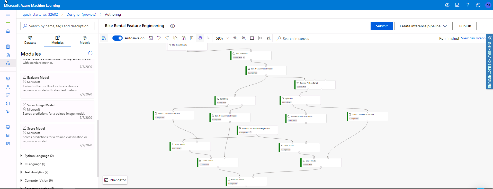

# Day 9

* Learned about features and feature engineering as an important part of data preparation.
* The process of selecting the most relevant features-> Feature Selection and its importance.
* Though feature engineering is the most important task in data preparation, it is not always necessary.
* The difference between classical ML and deep learning with respect to the need for feature engineering.
* Flagging, binning, embedding, aggregation as some examples of feature engineering tasks.
* Feature selection which deals with highly irrelevant or redundant features and the curse of dimensionality
* Dimensionality reduction algorithms PCA, t-SNE, Feature Embedding
* Feature selection modules on Azure ML filter-based feature selection, permutation feature importance.
* Had some challenges with lab 3 Engineer and Select Features  I have been running it for more than 30 minutes and it failed at some point.

 

I was able to fix the error I had while running lab 3. I realized that when I copy a particular `Select Columns in Dataset` and paste, any 
changes in one affects the other and this was the reason behind the issue I had.The pipeline ran successfully and I went ahead to look at the 
results of the evaluation.
**Note:** In this task, we trying to visualize the importance of feature engineering. So, two models were created, one using the raw data
as it was and the one with engineered features.
The code used for feature engineering in this lesson
```
# The script MUST contain a function named azureml_main
# which is the entry point for this module.

# imports up here can be used to
import pandas as pd
import numpy as np

# The entry point function can contain up to two input arguments:
#   Param<dataframe1>: a pandas.DataFrame
#   Param<dataframe2>: a pandas.DataFrame
def azureml_main(dataframe1 = None, dataframe2 = None):

    # Execution logic goes here
    print(f'Input pandas.DataFrame #1: {dataframe1}')

    # If a zip file is connected to the third input port,
    # it is unzipped under "./Script Bundle". This directory is added
    # to sys.path. Therefore, if your zip file contains a Python file
    # mymodule.py you can import it using:
    # import mymodule

    for i in np.arange(1, 13):
        prev_col_name = 'cnt' if i == 1 else 'Rentals in hour -{}'.format(i-1)
        new_col_name = 'Rentals in hour -{}'.format(i)

        dataframe1[new_col_name] = dataframe1[prev_col_name].shift(1).fillna(0)

    # Return value must be of a sequence of pandas.DataFrame
    # E.g.
    #   -  Single return value: return dataframe1,
    #   -  Two return values: return dataframe1, dataframe2
    return dataframe1,
    ```
**The Evaluation Results**
1[Evaluation](lab3Evaluation.PNG)

#50daysofudacity:fire:
